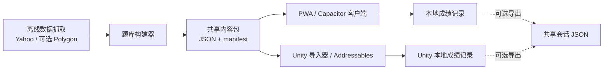
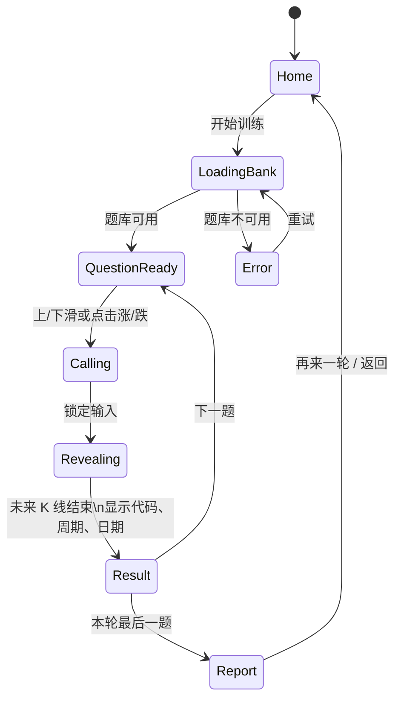

# tickread Mobile — 产品与系统设计

**状态：** DESIGN_DRAFT  
**日期：** 2026-08-15  
**关联产品：** `project/tickread`

## 1. 愿景

tickread Mobile 是一个以手机单手操作为核心的市场直觉训练应用。用户看一段
被隐藏名称与日期的 K 线，在有限时间内判断价格接下来会上涨或下跌；答案揭晓
后，应用显示真实走势、标的代码、K 线周期及日期范围，再将表现汇总成可理解的
个人能力报告。

它不是交易工具，也不提供买卖建议或实时行情。它的价值是把“看图猜方向”变成
可重复、可回顾的训练。

## 2. 产品原则

1. **先判断，后揭晓。** 作答前绝不显示代码、日期或绝对价格；揭晓后必须明确
   展示正确方向和标的资料。
2. **一只手完成一题。** 上滑代表看涨、下滑代表看跌；底部的大型「涨 / 跌」按钮
   是等价且无障碍的替代输入。
3. **图表是主角。** 不在图上叠加复杂指标、新闻或交易提示。每屏只回答一个问题。
4. **离线优先。** 已下载题库和历史成绩在无网络时仍可使用。
5. **同一题、同一结果。** PWA、未来的原生壳和 Unity 客户端对同一题目的判定、
   方向、时间和统计结果完全一致。

## 3. 目标平台与交付顺序

| 阶段 | 平台 | 目的 |
|---|---|---|
| 1 | Mobile Web + PWA | 以现有 TypeScript 静态站快速验证手机体验；支持安装到主屏幕。 |
| 2 | Capacitor 原生壳（iOS / Android） | 复用 PWA，取得应用商店分发、触觉反馈与本地文件能力。 |
| 3 | Unity 客户端 | 作为更有游戏感的训练客户端或嵌入其他 Unity 体验，读取相同的共享内容。 |

阶段 1 不依赖帐号或后端。阶段 2 和 3 也不得各自生成题目或重新计算答案；它们只
消费共享题库和共享会话格式。

## 4. 信息架构与 UI

### 4.1 首页 / 继续训练

顶部为 `tickread` 标识、当前训练进度和历史命中率。主体是一张自动播放的示例图，
让首次用户无需阅读长说明即可理解“观察 → 判断 → 揭晓”。主按钮为「开始 10 题」。

底部提供三个轻量入口：训练记录、设置、数据说明。首页不显示任何实时价格或市场
推荐。

### 4.2 作答屏

```
┌────────────────────────────────────┐
│  DAILY · US EQUITY · NEXT 5 BARS   │
│  4 / 10                 streak 2   │
│                                    │
│        Where does price go?         │
│  ┌──────────────────────────────┐  │
│  │                              │  │
│  │          K 线 + 成交量         │  │
│  │       （未来走势隐藏）          │  │
│  │                              │  │
│  └──────────────────────────────┘  │
│                                    │
│  [ ↓ 看跌 / Price falls ] [ ↑ 看涨 ] │
│        或直接下滑 / 上滑             │
└────────────────────────────────────┘
```

- 图表区域占可用高度的 55–65%，始终保留安全边距和底部系统手势区。
- 上滑 / 下滑时，卡片沿同方向轻微移动、显示相应绿/红提示；未超过阈值则弹回。
- 按钮最小高度 52 px，两个选择颜色之外还使用箭头与文字，不能仅依赖颜色。
- `↑` / `↓` 键保留给外接键盘和桌面调试，不是手机端的主要提示。

### 4.3 答案揭晓屏

卡片留在原位置，未来 K 线逐根显现，避免把图表滑出屏幕。最后一根 K 线落下后，
结果卡片出现：

```
正确 — 实际上涨 2.4%
AAPL · 日线 · 2025-03-05 – 2025-03-12
你的判断：看涨 · 用时 1.3 秒
```

结果停留至少 2.2 秒；用户可点击「下一题」立即前进。这样既能看到真实答案，也不会
让熟练用户被固定等待时间阻塞。

### 4.4 训练报告

一轮默认 10 题。报告依次显示：总命中率、连续答对数、按资产类别 / 周期 / 预测跨度
划分的能力地图，以及决策风格（偏多、趋势跟随/均值回归、成交量敏感度、反应速度）。

报告使用卡片和短句解释统计不确定性；样本不足时显示「样本不足」，绝不把缺失数据
伪装为 0%。

### 4.5 视觉语言与无障碍

- 深石墨色背景、暖白内容卡片；上涨为绿色、下跌为红色，但两者均有方向箭头与文字。
- 行情数字使用等宽字体；说明文字使用系统字体。
- 支持深色模式、`prefers-reduced-motion`、动态字体和屏幕阅读器状态播报。
- 动画只服务反馈：作答有轻微触觉/视觉确认，揭晓逐根播放；不使用会妨碍阅读的抖动。

## 5. 系统架构



### 5.1 内容层

现有 Python 数据管线继续在构建期拉取并校验 OHLCV 数据，生成静态题库。每题包含：

- 隐藏期使用的 K 线与未来 K 线；
- 标的代码、资产类别、时间周期、起止 UTC 时间；
- 已计算的正确方向。

标的资料只在客户端完成答题后渲染。共享内容包不包含用户资料、API Key 或实时网络
调用。

### 5.2 客户端层

客户端分为四个职责：题库读取、回合编排、输入/动画呈现、成绩与报告。题目抽取、
方向判定和统计公式必须来自共享的确定性规则；呈现层可以分别采用 DOM/Canvas 或
Unity UI/图表渲染。

PWA 使用 Service Worker 缓存应用壳和当前题库版本。更新时在下一次启动下载新版本，
不会打断正在进行的回合。

### 5.3 本地数据与隐私

默认只有设备本地历史记录。没有登录、广告追踪或服务端数据库。用户可在设置中：

- 导出成绩 JSON；
- 导入先前导出的成绩；
- 清空本地训练记录和缓存题库。

未来若加入同步，应采用用户主动登录、端到端可理解的隐私说明，以及与现有共享会话
格式兼容的服务端存储；它不属于第一版。

## 6. Web / Unity 共享契约

共享的不是 UI 代码，而是版本化数据契约和测试样例。它们放在 `shared/`，由 PWA 和
Unity 同时消费。

| 文件 | 用途 | Unity 侧对应物 |
|---|---|---|
| `question-bank.v2.json` | 题库与题目元数据 | JSON 导入为 `QuestionDefinition` ScriptableObject 或 Addressables 资源 |
| `manifest.v2.json` | 题库版本、分片、校验摘要 | 内容版本检查与下载清单 |
| `session-record.v1.json` | 一轮答案与反应时间 | `SessionRecord` 可序列化 DTO |
| `fixtures/` | 固定题目与预期统计结果 | Unity PlayMode / EditMode 测试输入 |

统一约束：

- UTC 时间使用 Unix 秒；不传设备本地时区。
- 方向枚举只有 `up`、`down`；不得使用平台特定的布尔值或本地化文案作为存储值。
- 价格使用 JSON number；显示精度由各客户端格式化，判定始终使用原始数值。
- 题目 ID 为稳定、不含可读代码的哈希；代码与日期是独立的揭晓字段。
- 构建器对共享格式做 JSON Schema 校验；PWA 与 Unity 对相同 fixture 产生相同的
  `correct`、命中率和分组统计。

Unity 不直接调用 Yahoo / Polygon，也不从画面反推正确答案。它只下载或随包附带经过
构建器验证的内容包，以确保与 Web 版完全一致且可离线运行。

## 7. 回合状态机



## 8. 角色与交付流程

| 角色 | 责任 | 主要产物 |
|---|---|---|
| 产品 / 设计 | 训练流程、信息层级、无障碍与文案 | 本设计稿、交互验收标准 |
| 数据管线 | 获取、校验和构建共享题库 | 版本化内容包与 fixtures |
| PWA 客户端 | 手机 UI、离线缓存、Web 成绩记录 | 可安装 Web App |
| Unity 客户端 | 导入共享包、Unity 输入与渲染、离线记录 | Unity 场景、导入器、测试 |
| QA | 共享 fixture 一致性、手势、离线和无障碍 | Web / Unity 测试报告 |

工作流：内容变更先更新共享契约和 fixture；两端通过兼容性测试后才能使用新 manifest
版本。UI 改动不应改变题目判定和历史成绩的含义。

## 9. 非目标

- 不在第一版提供实时行情、下单、价格预警或投资建议。
- 不要求 PWA 与 Unity 共用渲染代码、Canvas、动画或 UI 组件。
- 不在第一版提供账号、排行榜、社交分享或云端同步。

## 10. 开放项

1. Unity 的定位：独立移动 App、桌面训练版，还是嵌入既有 Unity 游戏？这会影响
   Addressables、商店包体与触觉反馈方案。
2. 是否需要完全离线随包题库，还是首次安装后下载题库？前者启动最快但安装包更大。
3. PWA 是否仅作为分发验证，还是长期与 Unity 版本并行维护？
4. 回合长度暂定为 10 题；是否按用户水平开放 5 / 10 / 20 题模式？

在以上问题确认前，本设计仅定义共享内容与体验边界，不锁定具体框架或商店发布方案。
